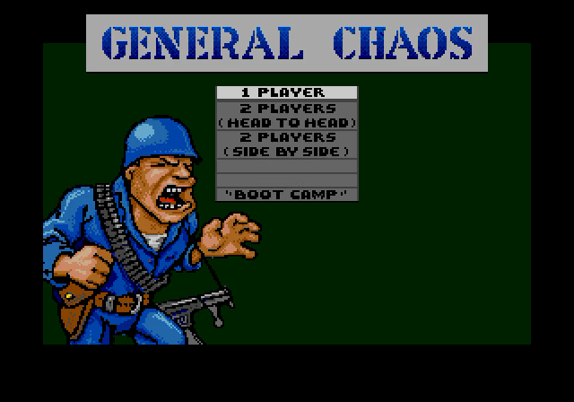
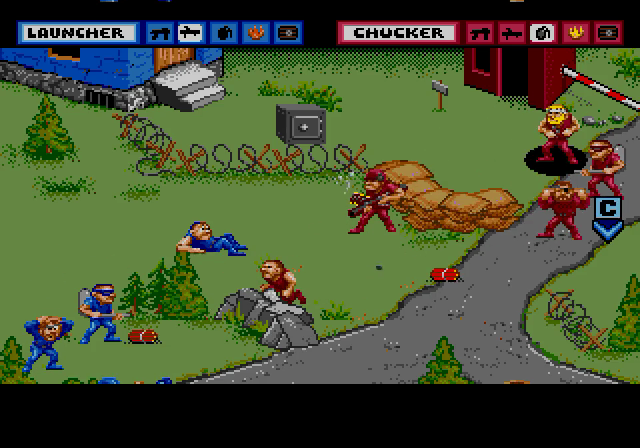
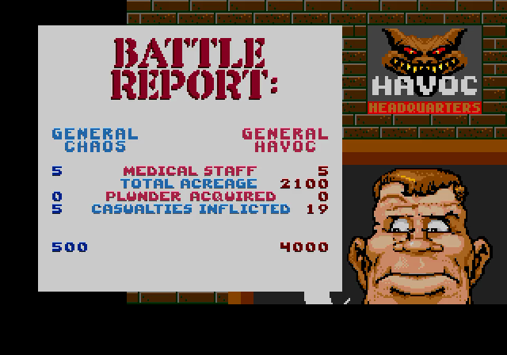

# General Chaos: Recompiled

A static recompilation of *General Chaos* (Sega Genesis, 1993; Brian Colin and
Jeff Nauman, Game Refuge Inc., published by Electronic Arts). The game's 68000
code is translated ahead of time into C by
[genrecomp](https://github.com/sp00nznet/genrecomp)'s shared recompiler and
compiled into a native Windows program. The Genesis video, sound and I/O chips
come from genrecomp, which wraps Genesis Plus GX.

You supply your own ROM. Everything generated from it stays on your machine:
this repo holds a small title config and the hand-written glue, never the ROM,
its disassembly, or the C generated from it.

## Status

**Alpha.** Boots through the EA logo, title card, credits and main menu, the
War Room, the Checkpoint Chaos map and squad selection, and plays battles: your
squad and General Havoc's fight, close combat, "Reality Check / Press Start"
when your squad falls, and the Battle Report afterwards. A scripted
9,000-frame headless run with input finishes with no dispatch misses or bad
returns.

Not verified yet: audio by ear, a full campaign, two-player modes. See
[docs/debugging.md](docs/debugging.md) for how it was brought up and what's
known.

## Screenshots

Recorded headless from the recompiled build:





## Getting Started

You need your own *General Chaos (USA, Europe)* ROM: 1 MB, unzipped (`.gen` or
`.bin`). Windows 10/11 only for now.

### Quick start

1. Download this repo (Code → Download ZIP) and unzip it, or clone it.
2. Put your ROM in the same folder (or have its path ready).
3. Double-click **`Setup.cmd`**. It checks for Git, CMake, Visual Studio 2022
   (C++ workload), Python 3 with `capstone`, SDL2 (via vcpkg) and genrecomp,
   and **asks before installing** anything missing, saying what and how big.
   It then checks your ROM, generates the C source from it, builds, and runs a
   600-frame headless smoke test. If a step fails, it stops with one sentence
   on what to do and keeps the details in `setup.log`. Rerunning skips finished
   steps.
4. Double-click **`Play General Chaos.cmd`**, which Setup leaves in the folder.

### Step by step

Prerequisites: Git, CMake 3.16+, Visual Studio 2022 with "Desktop development
with C++", Python 3.10+ with `capstone` (`py -3 -m pip install capstone`), SDL2
via vcpkg (`C:\vcpkg\vcpkg.exe install sdl2:x64-windows`). `ffmpeg` on PATH is
only needed for `--record`.

1. Put genrecomp beside this folder:
   ```
   gen\
     genrecomp\   git clone --recursive https://github.com/sp00nznet/genrecomp.git
     genchaos\    this repo
   ```
2. Generate the C source from your ROM (about 15 s):
   ```
   py -3 ..\genrecomp\tools\recompiler\generate.py "path\to\General Chaos.gen" -o src\recomp -c recomp.json
   ```
   Expected last lines: `Generated 60 source files with about 2980 functions` and `Done!`.
3. Configure and build:
   ```
   cmake -S . -B build -A x64 -DCMAKE_TOOLCHAIN_FILE=C:/vcpkg/scripts/buildsystems/vcpkg.cmake
   cmake --build build --config Release
   ```
   Expected last line: `genchaos.vcxproj -> ...\build\Release\genchaos.exe`.
4. Run it:
   ```
   build\Release\genchaos.exe "path\to\General Chaos.gen"
   ```

Usual trip-ups:
- `python` opens the Microsoft Store: that's the Store alias, not Python.
  Use `py -3`, or turn the alias off in Settings → Apps → App execution aliases.
- `ModuleNotFoundError: No module named 'capstone'`: `py -3 -m pip install capstone`.
- `src/recomp/ is empty` from CMake: step 2 hasn't run.
- A new terminal is needed after installing a tool, so PATH picks it up.

## Usage

Controls: arrow keys = D-pad, Z/X/C = A/B/C, Enter = Start, Esc = quit.

Headless (no window; works over RDP), recorded to video, with scripted presses
that start a one-player game and pick squads:

```
build\Release\genchaos.exe --headless --frames 6000 --record battle.mp4 ^
  --press 2300:START:10 --press 2700:START:10 --press 3100:START:10 ^
  --press 3400:A:10 --press 3700:C:10 --press 4000:B:10 --press 4300:A:10 ^
  "path\to\General Chaos.gen"
```

All flags come from genrecomp (its `docs/recomp-runtime.md`).
`GENCHAOS_STACK=1` prints where the game's main thread is every second.

## How it works

`recomp.json` tells genrecomp's recompiler what it can't find by itself: 16
entry points reached only through data, and the sound-command dispatch table.
The recompiler turns the rest of the ROM into C (genrecomp
`docs/recompiler.md`). `src/main.c` takes the entry point, stack and VBlank
handler from the ROM's vector table and drives frames from genrecomp's
scanline clock.

## Building from source

Step by step above is the build. Delete `src\recomp` to have Setup regenerate it.

## License

MIT for this repo's code ([LICENSE](LICENSE)). Binaries link Genesis Plus GX
through genrecomp, and its licence forbids commercial use, so builds are
non-commercial (genrecomp's `NOTICE`). The game belongs to its rights holders;
bring your own legally obtained ROM.

## Related

- [genrecomp](https://github.com/sp00nznet/genrecomp): the Genesis runtime and recompiler
- [pigskin](https://github.com/sp00nznet/pigskin): Pigskin Footbrawl, the other title on it
